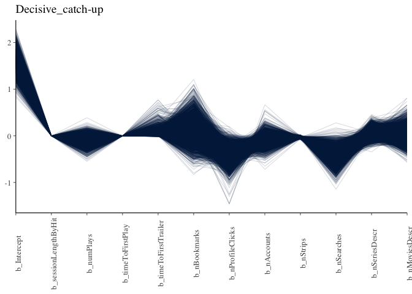
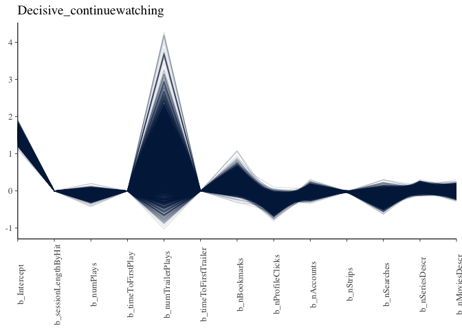
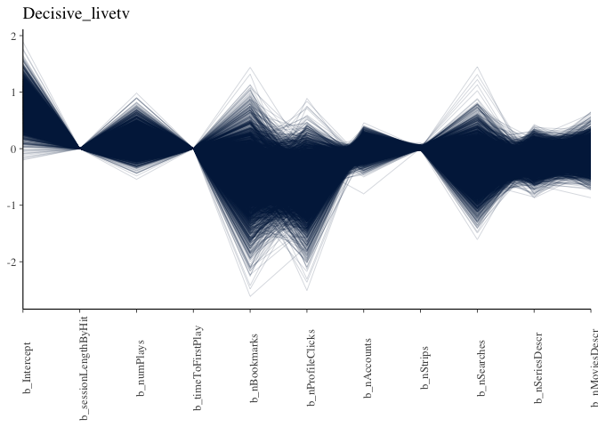
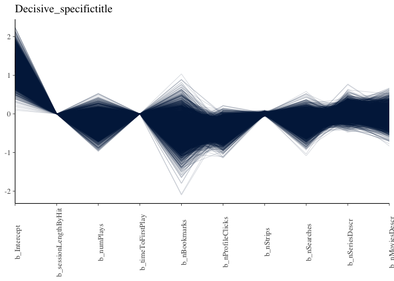
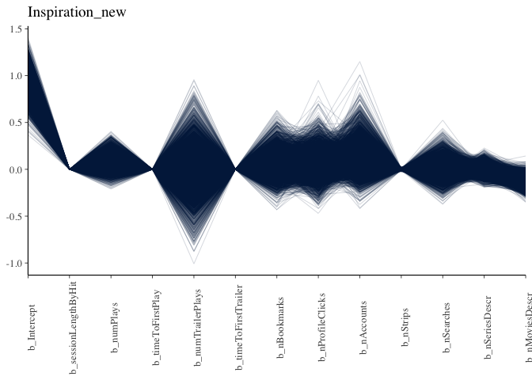
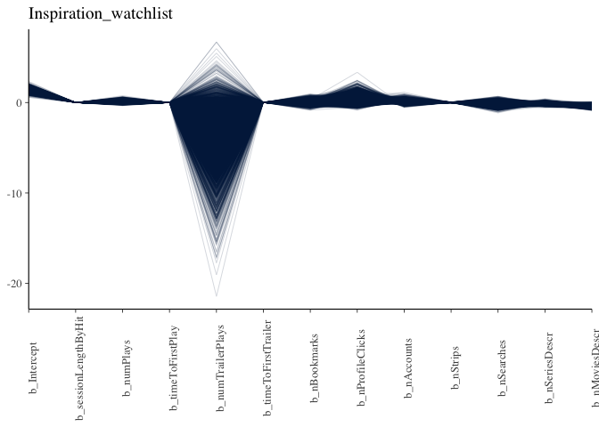

Intent-based Satisfaction Modeling – From Music to Video Streaming
================
Gabriel

  - [1 libraries](#libraries)
  - [2 Data prep](#data-prep)
      - [2.1 Trivial Fake Data](#trivial-fake-data)
      - [2.2 Behavioral data](#behavioral-data)
      - [2.3 available Vars](#available-vars)
  - [3 Vizualizations](#vizualizations)
      - [3.1 Descriptive stats on Behavioral
        Vars](#descriptive-stats-on-behavioral-vars)
      - [3.2 The Satisfaction histogram](#the-satisfaction-histogram)
      - [3.3 Violin Plots](#violin-plots)
      - [3.4 Corrplots](#corrplots)
  - [4 Modelling](#modelling)
      - [4.1 per intent logistic Bayes
        regression](#per-intent-logistic-bayes-regression)
      - [4.2 Chain PLots](#chain-plots)

This repository contains the supporting material for the paper
*Intent-based Satisfaction Modeling – From Music to Video Streaming*.

The plots shown here are made with real OurPlatform \[anonymized\] data.
In order to run the code yourself, clone the repo and run the .Rmd file.
Trivial data simulation is provided below instead of real user data
(GDPR compliance). You can expect therefore the plots to change.

# 1 libraries

``` r
# data wrangling
library(data.table) # faster and arguably nice syntax
library(magrittr) # allows piping such as %>% or %<>%
library(stringr) # for string operations like str_replace
library(tidyr) # separate
library(knitr) # especially to make tables with kable
library(dplyr)
library(purrr)

# plotting
library(ggcorrplot)
library(ggplot2)

# Bayes
library(tidybayes)
library(bayesplot) # plot bayesian model
```

# 2 Data prep

## 2.1 Trivial Fake Data

This is probably a research topic of its own. This data is only there
for the code to run. We thus go with the simplest approach, without
considering correlations between variables.

``` r
possibleIntents <- c('Decisive - catch-up' , ' Decisive - continuewatching' , ' Decisive - livetv' , ' Decisive - specifictitle' , ' Explorative - addwatchlist' , ' Explorative - genre' , ' Explorative - new' , ' Explorative - watchlist')

behaviorNames <- c('numPlays' , ' timeToFirstPlay' , ' numTrailerPlays' , ' timeToFirstTrailer' , ' nBookmarks' , ' nProfileClicks' , ' nAccounts' , ' nStrips' , ' nSearches' , ' nSeriesDescr' , ' nMoviesDescr' , ' sessionLength')
  
N <- 3000

responded <- data.frame(satisfaction = sample(1:5, N, replace = T)) %>% setDT
responded[,  (possibleIntents) := sample(0:1, N, replace = T)]
responded[,  (behaviorNames) := rnegbin(N, mu = 1, theta = 1)]
```

## 2.2 Behavioral data

If you are running a website and are tracking users with Google
Analytics, the Bigquery code [here](source/intentRetrieval.sql), will
allow you to retrieve the same behavioral data as ours. Custom
dimensions are proper to our platform and will differ depending on your
setup.

## 2.3 available Vars

``` r
behaviorNames <- names(responded[,numPlays : sessionLength]) # get all behavior variable names
behaviors <- behaviorNames %>% paste(., collapse =" + ") # useful for modelling

possibleIntents <- names(responded[,`Decisive - catch-up`:`Explorative - watchlist`])

kable(list(data.frame("intents" = possibleIntents), data.frame("behaviorals" = behaviorNames)))
```

<table class="kable_wrapper">

<tbody>

<tr>

<td>

| intents                     |
| :-------------------------- |
| Decisive - catch-up         |
| Decisive - continuewatching |
| Decisive - livetv           |
| Decisive - specifictitle    |
| Explorative - addwatchlist  |
| Explorative - genre         |
| Explorative - new           |
| Explorative - watchlist     |

</td>

<td>

| behaviorals        |
| :----------------- |
| numPlays           |
| timeToFirstPlay    |
| numTrailerPlays    |
| timeToFirstTrailer |
| nBookmarks         |
| nProfileClicks     |
| nAccounts          |
| nStrips            |
| nSearches          |
| nSeriesDescr       |
| nMoviesDescr       |
| sessionLength      |

</td>

</tr>

</tbody>

</table>

# 3 Vizualizations

## 3.1 Descriptive stats on Behavioral Vars

We show log values given the skewness of the data

``` r
d[, ..behaviorNames] %>% gather %>% ggplot(aes(log(value))) + 
  facet_wrap(~ key, scales = "free") + geom_histogram()
```

<!-- -->

### 3.1.1 for the quite satisfied (y \>= 4)

``` r
intents[satisfactionBin == 1, sessionLengthByHit:nStrips] %>%
  keep(is.numeric) %>% 
  gather() %>% 
  ggplot(aes(log(value))) +
    facet_wrap(~ key, scales = "free") +
    geom_histogram()
```

<!-- -->

### 3.1.2 for the less satisfied (y\<4)

``` r
intents[satisfactionBin == 0, sessionLengthByHit:nStrips] %>%
  keep(is.numeric) %>% 
  gather() %>% 
  ggplot(aes(log(value))) +
    facet_wrap(~ key, scales = "free") +
    geom_histogram()
```

<!-- -->

## 3.2 The Satisfaction histogram

``` r
# Daltonian palette https://jfly.uni-koeln.de/color/
cbp1 <- c("#999999", "#E69F00", "#56B4E9", "#009E73",
          "#F0E442", "#0072B2", "#D55E00", "#CC79A7")


## hist
ggplot(d, aes(x=satisfaction, y = ..count.., fill = satisfaction)) +
  geom_bar(width = 0.5) + theme_classic() +
  theme(text = element_text(size = 14))
```

<!-- -->

## 3.3 Violin Plots

### 3.3.1 Violins of Satisfaction and Intents

``` r
ggplot(intentsPure, aes(intent, satisfaction, fill = factor(group))) + 
  # stat_summary(fun.y=mean, geom="point", shape=23, size=2) +
  geom_violin() +
  stat_summary(fun.y=mean, geom="point") +
  # geom_jitter(shape=16, position=position_jitter(0.2), alpha = 1) +
  # geom_boxplot(width=0.1) +
  theme_classic() +
  theme(axis.text.x = element_text(angle = 45, hjust=1, size = 14)) +
  theme(axis.text.y = element_text(size = 14)) +
  theme(legend.position="none") +
  facet_grid(~group, 
             scales = "free_x", # Let the x axis vary across facets.
             space = "free_x",  # Let the width of facets vary and force all bars to have the same width.
             switch = "x") +
  theme(strip.placement = "outside",                      # Place facet labels outside x axis labels.
        strip.background = element_rect(fill = "grey90", color = "white"),
        strip.text = element_text(size = 14),# Make facet label background white.
        axis.title.x=element_blank(),
        axis.title.y=element_text(size = 14))  +
  scale_fill_manual(values = cbp1[c(7,8)])
```

<!-- -->

### 3.3.2 Violins of Satisfaction and Behavioral Variables

``` r
satBehavLong <- melt(intents, id.vars = c("sessionId", "satisfaction"),
                     measure.vars = behaviorNames,
                     variable.name = "behavioral variable")

ggplot(satBehavLong[value >= 1], 
       aes(x= log(value), y = satisfaction, group = satisfaction, fill = as.factor(satisfaction))) +
  geom_violin() +
  facet_wrap(~`behavioral variable`, scales = "free") +
  theme_classic() +
  theme(legend.position="none") +
  scale_fill_brewer(palette="Set1")
```

<!-- -->

## 3.4 Corrplots

``` r
## cor plot data prep
corrIntentBehav <- cor(oneHot[, `Decisive - catch-up`:`Explorative - watchlist`],
                       oneHot[, ..behaviorNames])

p.mat <- psych::corr.test(oneHot[, `Decisive - catch-up`:`Explorative - watchlist`],
                       oneHot[, ..behaviorNames]) #, adjust="none")

scaledCorr <- corrIntentBehav * 10
```

The original corrplot

``` r
ggcorrplot(scaledCorr, show.legend=T) + # lab = TRUE
  scale_fill_gradientn("",
                       colours = c("darkblue","white","red"),
                       values = scales::rescale(c(min(scaledCorr), 0, max(scaledCorr))),
                       labels = c(round(min(scaledCorr), 1), -0.60, 0,
                                  0.60, round(max(scaledCorr), 1)))
```

<!-- -->

The corrplot with significance testing (corrected for multiple testing,
significance level 0.05). A cross indicates insignificant correlations.

``` r
ggcorrplot(scaledCorr, show.legend=T, p.mat = p.mat$p, pch.cex = 2) + # lab = TRUE
  scale_fill_gradientn("",
                       colours = c("darkblue","white","red"),
                       values = scales::rescale(c(min(scaledCorr), 0, max(scaledCorr))),
                       labels = c(round(min(scaledCorr), 1), -0.60, 0,
                                  0.60, round(max(scaledCorr), 1)))
```

<!-- -->

# 4 Modelling

5-fold trainval / test (80 / 20 %). For each trainval set, 5-fold tain /
val (80 / 20 %).

``` r
source("source/utils.R")

methodsParams <- list("w/o intent" = list(m = "logistic", withIntent = F, RE = F),
                      "w intent"  = list(m = "logistic", withIntent = T, RE = F),
                      "multilevel"  = list(m = "logistic", withIntent = T, RE = T),
                      "xgboost w/o intent" = list(m = "xgboost", withIntent = F, RE = F),
                      "xgboost w intent" = list(m = "xgboost", withIntent = T, RE = F))

overallResults <-
  rbind(
    crossT(5, 5, responded, response = "satisfactionBin", methodsParams),
    crossTByIntent(5,5, response = "satisfactionBin")
  )

satResults <-
  rbind(
    crossT(5, 5, responded, response = "satisfied", methodsParams),
    crossTByIntent(5,5, response = "satisfied")
  )


unsatResults <-
  rbind(
    crossT(5, 5, responded, response = "dissatisfied", methodsParams),
    crossTByIntent(5,5, response = "dissatisfied")
  )

results <- cbind(overallResults[,1],
                 overallResults[,Accuracy:F1],
                 satResults[,Accuracy:F1],
                 unsatResults[,Accuracy:F1])

kbl(results, format="latex", booktabs = T, escape = F, linesep = linesep(11)) %>%
  add_header_above(
    c(" " = 1,
      "Overall ($\\\\mathds{1}_{\\\\hat{\\\\mathbf{y}} \\\\geq 4}$)" = 4,
      "Satisfied ($\\\\mathds{1}_{\\\\hat{\\\\mathbf{y}} = 5}$)" = 4,
      "Unsatisfied ($\\\\mathds{1}_{\\\\hat{\\\\mathbf{y}} = 1}$)" = 4),
    escape = F)
```

## 4.1 per intent logistic Bayes regression

### 4.1.1 modelling

``` r
for (i in possibleIntents){
  logisticBayes <- brm(
    formula = as.formula(paste("satisfactionBin ~", behaviors)),
    data = responded[intent == i],
    family = bernoulli(link = logit),
    file = paste0("models/logistic_", i, ".rds"),
    chains = 4, cores = 4, backend = "cmdstanr"
  )
}

logisticBayes <- do.call('rbind', lapply(list.files("models", full.names = TRUE, pattern = "logistic_"), readRDS))
```

### 4.1.2 plotting

``` r
posteriors <- list()

j <- 1
for (i in possibleIntentsOrigNames){
  thisBayes <- readRDS(paste0("../intentBasedClustering/models/logistic_", i, ".rds"))
  thisPosterior <- thisBayes %>% as.array
  thisBayes %<>% tidy_draws()
  notConverged <- thisBayes %>% summarise_draws() %>%
    setDT() %>% .[rhat > 1.05 & grepl("b_", variable) , variable]

  posteriors[[j]] <- thisPosterior %>% .[,,!dimnames(.)$variable %in% c(notConverged, "lp__", "Intercept")]
  
  thisBayes %<>%
    gather_variables() %>%
    setDT() %>% .[!.variable %in% notConverged] %>%
    .[, var := str_replace(.variable, "b_", "")] %>%
    .[var %in% behaviorNames, ] %>%
    .[, satisfaction := .value] %>%
      .[, intent := i] %>%
    .[]

  if(j == 1){
    logisticBayes <- thisBayes
  } else {
    logisticBayes <- rbind(logisticBayes, thisBayes)
  }
  j <- j + 1
}

logisticBayes[, index := .I]
logisticBayes[, varIntent := paste0(var, intent)]

medians <- logisticBayes[!var %in% c("numTrailerPlays")] %>% # "timeToFirstTrailer", 
  .[, .(intent = intent, median = abs(median(satisfaction))), by = .(varIntent)]
medians <- unique(medians)
topVars <- setorder(medians, intent, -median)[, head(.SD, 3), by = intent][, varIntent]

logisticBayes$intent %<>% str_replace("Inspiration", "Explorative") %>% str_replace("_", " - ")

logisticBayes[varIntent %in% topVars] %>%
  ggplot(aes(y = var, x = satisfaction, fill = var)) +
  facet_wrap(~intent, ncol = 4, scales = "free") +
  ## stat_gradientinterval() +
  stat_halfeye(scale = 1.5, point_size = 1.5) +
  geom_vline(xintercept = 0, linetype="dashed") +
  theme_classic() +
  theme(axis.title.y=element_blank()) +
  scale_fill_manual(values=cbp1) +
  theme(legend.position="none", strip.background = element_rect(fill = "white", color = "white")) +
  scale_x_continuous(labels = scales::number_format(accuracy = 0.1))
```

<!-- -->

## 4.2 Chain PLots

<!-- --><!-- --><!-- --><!-- --><!-- --><!-- --><!-- --><!-- -->
